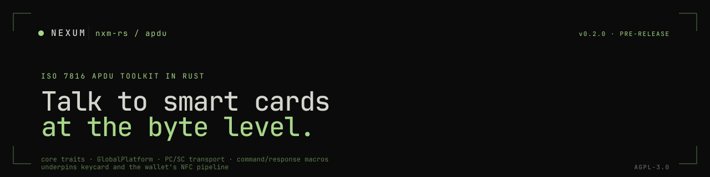

<p align="center">
  
</p>

A Rust toolkit for **ISO 7816 smart-card communication**. Core APDU traits, a GlobalPlatform profile, a PC/SC transport, and ergonomic macros for building typed command/response pairs.

This is the substrate the rest of the Nexum hardware-signing stack sits on: [`nxm-rs/keycard`](https://github.com/nxm-rs/keycard) drives Status Keycards through these primitives; [`nxm-rs/wallet`](https://github.com/nxm-rs/wallet) layers an NFC transport on top of the same `CardTransport` trait for mobile.

> **Pre-release.** APIs may change. Not yet on crates.io.

Looking for the org overview? See **[github.com/nxm-rs](https://github.com/nxm-rs)**. This repo was renamed from `nexum-apdu` to `apdu` on 2026-05-29; crate names (`nexum-apdu*`) are unchanged.

---

## Crates

| Crate | What it is |
|---|---|
| **[`nexum-apdu-core`](./nexum-apdu-core)** | `Apdu`, `Command`, `Response`, `CardTransport`, `CardExecutor`, errors |
| **[`nexum-apdu-globalplatform`](./nexum-apdu-globalplatform)** | GlobalPlatform commands (SELECT, INSTALL, LOAD, DELETE, secure channel) |
| **[`nexum-apdu-globalplatform-cli`](./nexum-apdu-globalplatform-cli)** | CLI for card administration via GlobalPlatform |
| **[`nexum-apdu-macros`](./nexum-apdu-macros)** | Derive macros for typed command/response APDU definitions |
| **[`nexum-apdu-transport-pcsc`](./nexum-apdu-transport-pcsc)** | PC/SC `CardTransport` implementation (desktop readers) |

For NFC transport, see `rust/nexum-apdu-transport-nfc` in [`nxm-rs/wallet`](https://github.com/nxm-rs/wallet) — same `CardTransport` trait, flutter_nfc_kit callback underneath.

---

## Quick start

```rust
use nexum_apdu_core::{CardExecutor, ApduCommand};
use nexum_apdu_transport_pcsc::PcscDeviceManager;

let manager = PcscDeviceManager::new()?;
let reader  = manager.list_readers()?.into_iter().find(|r| r.has_card()).unwrap();
let transport = manager.open_reader(reader.name())?;
let mut exec  = CardExecutor::new_with_defaults(transport);

let select = ApduCommand::new(0x00, 0xA4, 0x04, 0x00).with_data(b"\xA0\x00\x00\x00\x03\x00\x00\x00");
let response = exec.execute(&select)?;
```

Define typed commands ergonomically with the derive macros:

```rust
use nexum_apdu_macros::apdu_pair;

apdu_pair! {
    pub struct SelectCommand {
        cla: 0x00, ins: 0xA4, p1: 0x04, p2: 0x00,
        data: Vec<u8>,
    }
    pub enum SelectResponse {
        Success { fci: Vec<u8> } = 0x9000,
        NotFound = 0x6A82,
    }
}
```

---

## Contributing

Open an issue before non-trivial PRs. Conventional Commits, `Signed-off-by` (DCO), `cargo fmt`, `cargo clippy -- -D warnings`. CLA in [`CLA.md`](./CLA.md).

## Security

See [SECURITY.md](https://github.com/nxm-rs/.github/blob/main/SECURITY.md). APDU framing, secure-channel handling, and transport-boundary findings via GitHub Security Advisories on this repo.

## License

AGPL-3.0-or-later. See [LICENSE](./LICENSE).

```
●  AGPL-3.0  ·  pre-release  ·  the bytes under keycard
```
